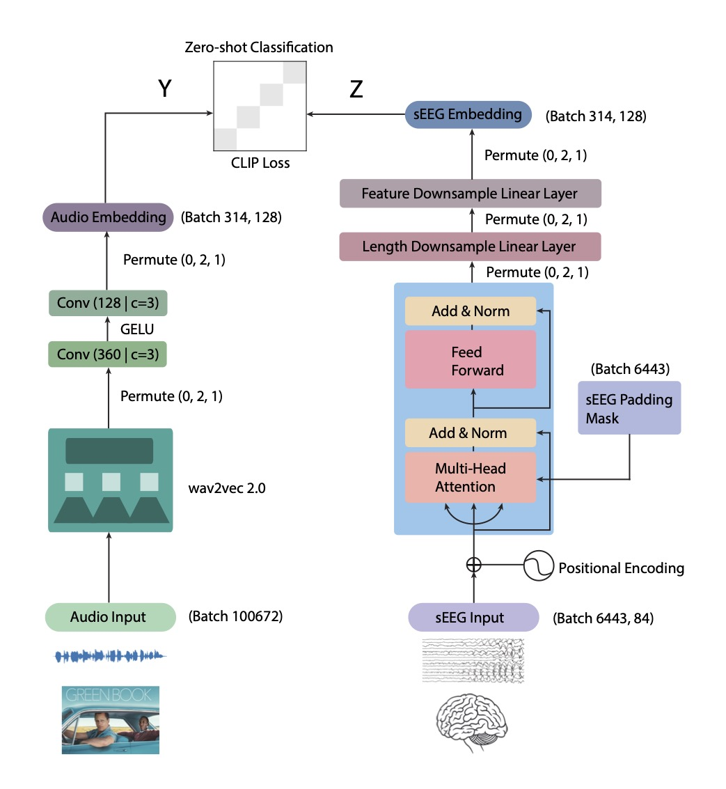

# Decoding Semantic Information from sEEG Recordings in a Naturalistic Setting

## Project Overview

In this project, our team - Sixuan Chen, Laila Johnston, Leyang Hu, and Yu-Ang Cheng - aims to extend the boundaries of speech decoding by applying advanced neural network models to Stereoelectroencephalography (sEEG) data. Our goal is to decode semantic information from sEEG recordings obtained in a naturalistic setting, specifically while subjects watch a movie. This approach allows us to capture a richer and more varied set of neural responses compared to traditional methods.

## Prerequisites

Ensure the following prerequisites are met for running the code:

1. **Install PyTorch with CUDA:**

   `pip3 install torch torchvision torchaudio --index-url https://download.pytorch.org/whl/cu118`

2. **Install Additional Dependencies:**

   `pip install -r requirements.txt`

​	Ensure you run this command in the root directory of the project.

## Training the Model

#### Initiating Training

To initiate the training process, execute the following command:

`python -m train.train`

Ensure you run this command in the root directory of the project.

#### Customizing Training Parameters

The training script supports various parameters for customization:

- `--exp_name` (`-e`): Sets the experiment name. This influences the directory where checkpoints and logs are saved. Default: 'lr_1e-3-batch_10-train_ratio-0.7'. Checkpoints and logs will be saved in `/experiments/$EXP_NAME`.
- `--lr` (`-l`): Specifies the learning rate. Default: `1e-3`.
- `--save_freq` (`-s`): Determines the frequency of model saving. Default: `1`.
- `--total_epoch` (`-t`): Sets the total number of training epochs. Default: `20`.
- `--cont` (`-c`): If specified, training will continue from the latest checkpoint in the specified experiment directory.
- `--batch_size` (`-b`): Configures the batch size. Default: `10`.
- `--data_file` (`-d`): Path to the `.npy` file containing the segmented data. Default: './data/data_segmented.npy'.
- `--train_ratio` (`-r`): Defines the ratio of training data to the total dataset. 1/3 of the remaining data will be used for testing and 2/3 for validation. Default: `0.7`.
- `--num_workers` (`-w`): Sets the number of workers for data loading. Default: `4`.
- `--num_output_channels` (`-o`): Configures the number of output channels for the sEEG encoder. Default: `64`.
- `--num_heads` (`-h`): Specifies the number of heads for the sEEG encoder. Default: `3`.
- `--num_encoder_layers` (`-n`): Determines the number of encoder layers for the sEEG encoder. Default: `6`.
- `--dim_feedforward` (`-f`): Sets the dimension of feedforward network in the sEEG encoder. Default: `2048`.

To use these parameters, append them to the training command. For example:

`python -m train.train --lr 0.001 --batch_size 20 --train_ratio 0.75 --num_heads 4 --num_encoder_layers 8`

This example command starts training with a learning rate of 0.001, a batch size of 20, 75% of the data for training, 4 heads, and 8 encoder layers for the sEEG encoder.

